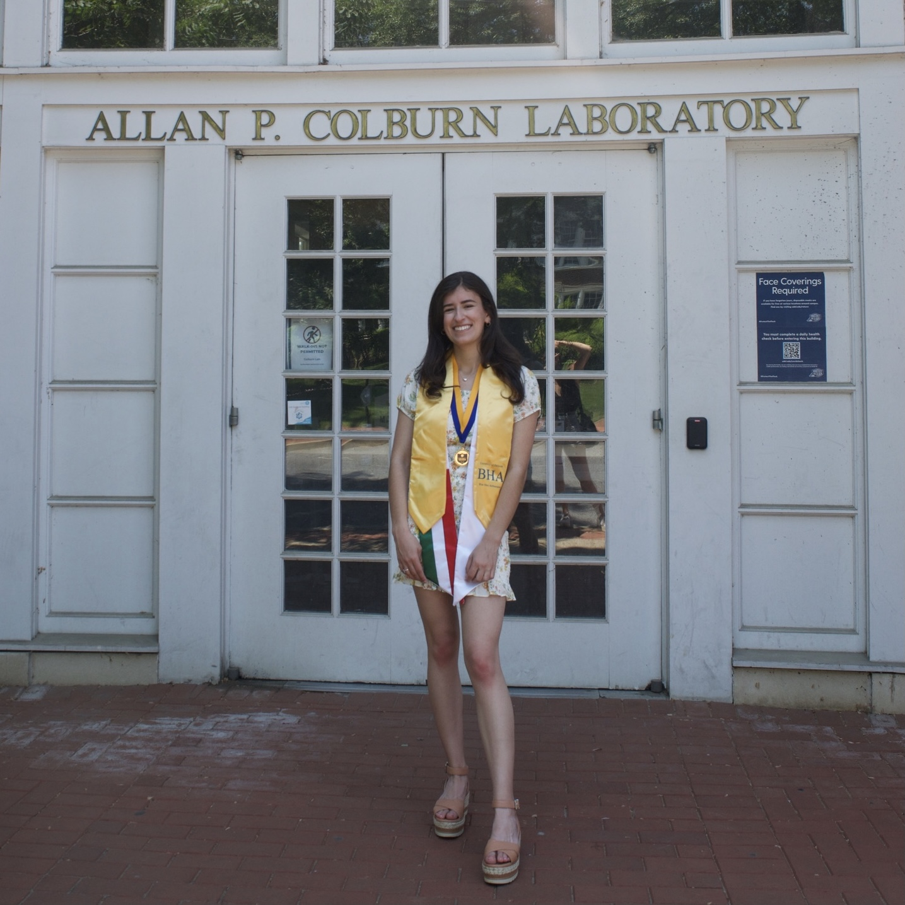
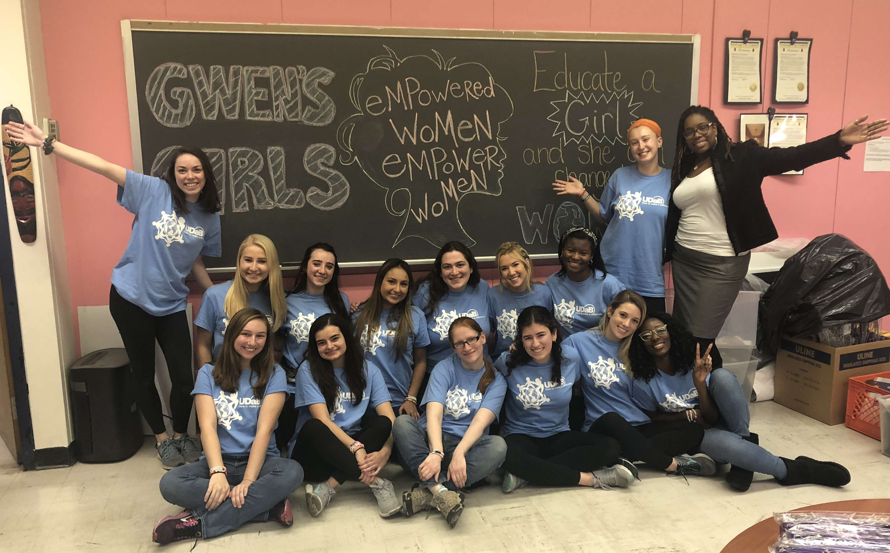

The first time that I envisioned my future as a scientist, I was standing in my elementary school cafeteria adorned in my homemade replica of Sally Ride’s space suit for our annual wax museum. From an early age, I was fascinated by everything from geology to physics, but there was a common theme in all of my lessons on influential scientists; whether it was Albert Einstein, Ben Franklin, or Isaac Newton, there was a stark lack of women in my textbooks. After learning about Sally Ride, I was finally able to envision myself among these great scientists, igniting a desire in me to make my own impact on the world. It wasn’t until my junior year of high school that I discovered my passion for chemistry. Combining my interests in both chemistry and design, I decided to pursue a degree in chemical engineering at the University of Delaware. 

As soon as I stepped foot on campus, I was itching to get involved with research and start applying the skills I began developing in high school to real-world challenges. As a freshman in [the Fromen Research Group](https://sites.udel.edu/cfromen/), I began training as a member of the 3D printing team, prototyping *in vitro* lung models, and later progressed to designing my own independent projects during my sophomore and junior years. Despite the COVID-19 pandemic derailing my planned research, I managed to contribute to two peer-reviewed publications, one being a first-author manuscript. My development as a scientist during this time would not have been possible without the valuable mentorship of Dr. Fromen and graduate student, Emily Kolewe. The opportunity to learn directly from up and coming female scientists has been invaluable for building my confidence as a researcher. My time in the Fromen Lab solidified my desire to become a professor and follow the path of women who have inspired me, allowing me to pursue my research interests and my passion for disseminating knowledge to scientists and non-scientists alike.

University of Delaware Graduation
 

Now, as a PhD student in [the Galloway Lab](https://gallowaylab.mit.edu/) at the Massachusetts Institute of Technology, I am excited to pivot my research into synthetic biology and apply my knowledge in kinetics, control systems, and molecular biology to design novel genetic circuits. Through this work, I hope to expand the existing synthetic biology toolbox to allow for more precise control of cell fate.

# Beyond the Lab

My love of scientific research began when I had the opportunity to attend PennGEMS at the University of Pennsylvania, a program aimed at introducing young girls to careers in STEM fields. From solving a crime using DNA extraction to coding my first video game, the experience truly sparked my interest in topics that would later form the basis of my research. Not only was this program my first introduction to engineering, but it was also my first exposure to female STEM role models. Completely run by women in UPenn’s College of Engineering, the program connected me to a female community of scientists that my education had led me to believe was effectively a male-exclusive opportunity. This foundational experience was hugely important to my resilience to remain in science when later faced with male-dominated classes and an inordinate female attrition rate in chemical engineering.  

I have been fortunate to form critical relationships early on with early career female researchers, such as Dr. Fromen, who have continually pushed me to improve myself. Nevertheless, there remains a lack of female figures in engineering to provide young students with crucial mentorship. Throughout high school and college, I sought to do my part to change this narrative by sharing my experiences with the next generation of girls and leading science demonstrations through partnerships with numerous community organizations including local libraries, The College School, and Gwen’s Girls. To develop my skills in science communication, I have volunteered my time as a video editor with Science Club for Girls and developed a module on vaccine design for University of Delaware K-12 Outreach. As a student, however, my sphere of influence has been relatively limited to my local community, and this has motivated me to pursue a career as a professor so I can simultaneously contribute to the advancement of the scientific research and promote the importance of women in STEM fields.

Volunteering at Gwen's Girls with UD's Alternative Breaks Program
 