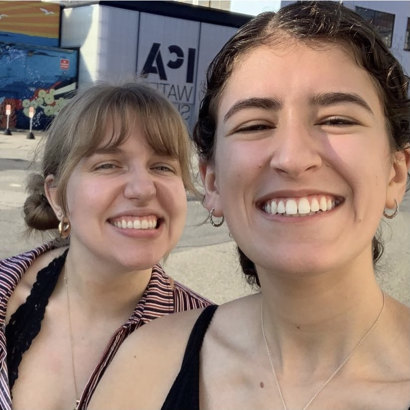
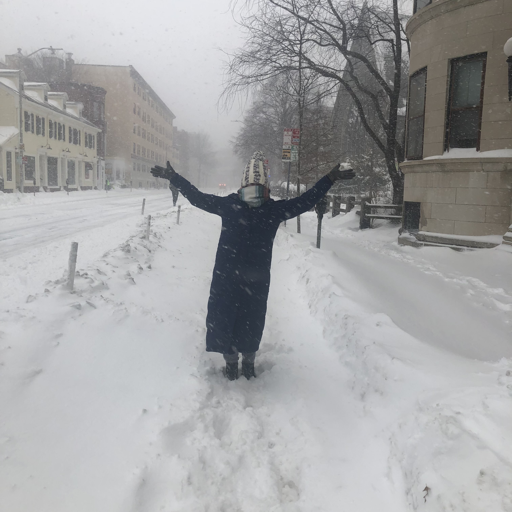
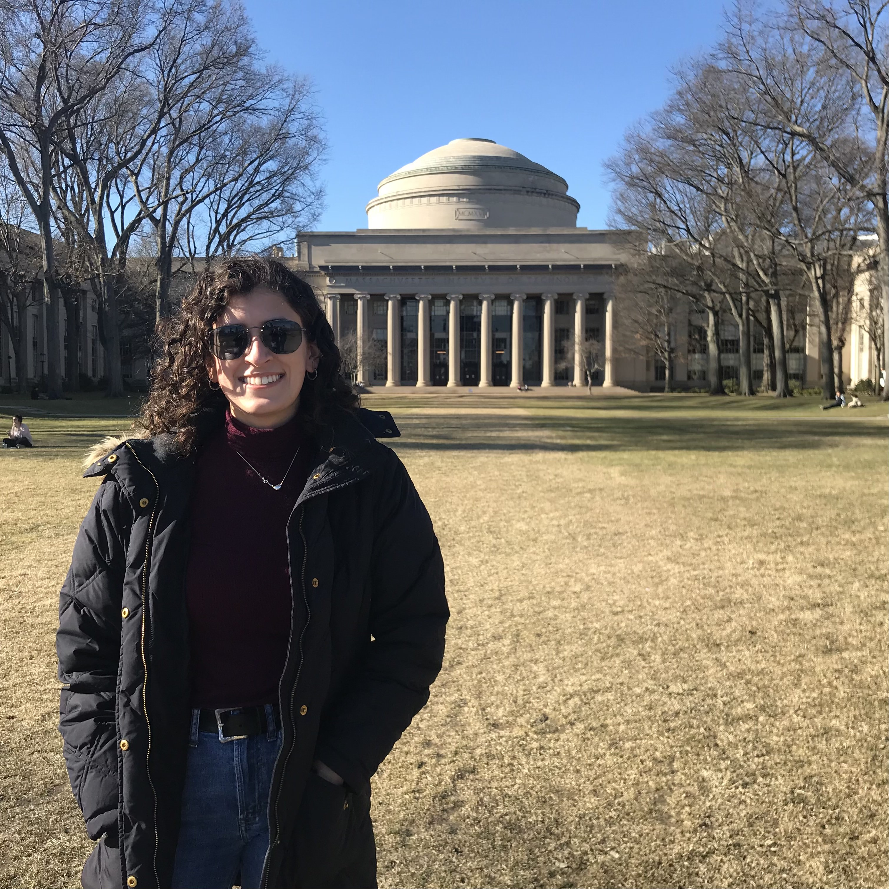

The first year of grad school is both an incredibly exciting and exhausting time. In the span of just a few short months, you have to balance a full schedule of advanced coursework and decide on a lab to join for the rest of your PhD, all while navigating a new city and new friendships. I could not be happier with my decision to attend MIT for grad school. However, the past year has not been without its challenges. Reflecting back on my experiences, I have compiled my advice for making the most out of your first year of grad school. Although this post represents only my personal experience, I hope it can serve as a resource for incoming first-years and those considering applying to grad school. 

A good work-life balance is one of the most important things to maintain in grad school. Not only will prioritizing this help your mental health, it will also ensure that you are present and engaged in your classes and research by preventing you from becoming burnt out. For me, I found that the best way to hold myself accountable for this was to **_commit to a consistent work schedule_**. At the beginning of the year, I decided that I would try to get to campus by 9 am every weekday. I find that I am much more productive and focused in the mornings, so having an hour to do work before my 10 am classes for the day was really valuable for me. This ideal working time is different for everyone, but aiming to having consistent working hours helped me stay on top of my responsibilities and minimize stress. 

In order to stick to this, though, I also needed to set limits on how late I worked to make sure I got enough rest. Sometimes this meant that I handed in problem sets with mistakes or lacking a final answer. In grad school, grades are much less important than developing and retaining skills. This year, I learned to **_prioritize understanding over perfection_** and recognize when to move on from a problem. With the rigor of first year classes, you will often have to learn difficult math concepts and new computational modeling techniques all through the lens of fundamental physical phenomena. Integrating all of these aspects is what distinguishes graduate from undergraduate courses. Many times I would find myself struggling to debug code for hours only to discover I had misplaced a parenthesis or forgotten a zero. Sinking time into finding these small errors did nothing to further my learning of the actual concepts being assessed. Oftentimes, coming back to the problem after a few hours or days would allow me to easily find and correct my mistakes. However, there were also times that the most I could manage was writing what I would've done if I had been able to find the mistakes. This is totally okay and to be expected in grad school! I found more value in defining my success based on the effort I put into an assignment rather than the grade I received. 

With all of this time spent working, it is crucial to **_be intentional about taking time off_**. Each day, I try to avoid working through lunch, sometimes using the break to walk around campus if the weather is nice. I always leave campus in time to make dinner with my roommate, [Ali](https://twitter.com/aligoldstein_), and chat about our days. I also try to take one day a week totally off from working and use these days to recharge and explore Cambridge. These ideas seem simple, but carving time out of my schedule to rest is absolutely essential for me to perform at my best and stay healthy. As I became busier throughout the semester, I found it harder and harder to maintain this personal time. Especially during my second semester with both research and classes, it felt easy to justify working weekends or staying late in lab. These were the times, though, that I could feel myself becoming fatigued and see the quality of my work dropping. When I look back on my first year, it is not the time spent in the office or at my desk that stands out, but the time I spent trying Downeast cider with Ali, seeing a game at Fenway with my cohort, and enjoying my first Cambridge snowstorm. Having this time set aside made it easier to get through difficult work during the week (and ensured I have some great memories from first year to look back on). 

Despite my best efforts to stick to these goals, sometimes imposter syndrome and stress got to me, leaving me with doubts about my ability to succeed in this program or academia as a whole. What helped me get through these moments was to **_remind myself of all I have accomplished to get to this point_**. For me, this means taking a few minutes to walk down by the Charles River and sit by the Dome. Being there always reminds me of how happy I was when I found out I was given the opportunity to study at MIT and puts the small magnitude of my daily challenges into perspective. When I accepted my offer at MIT, I felt grateful for the chance to learn from brilliant professors and peers, confident in my own abilities, and excited for the five years to come. Now at the end of my first year, I feel like I've already learned so much, both in my classes and my research, and made some amazing memories. I hope that through continuing these practices I can overcome challenges and maintain a positive outlook for the remainder of my PhD.

  

    
    Visiting Downeast Cider House
  

  

    
    First Boston snowstorm
  

  

    
    Visiting MIT in March 2021
  

